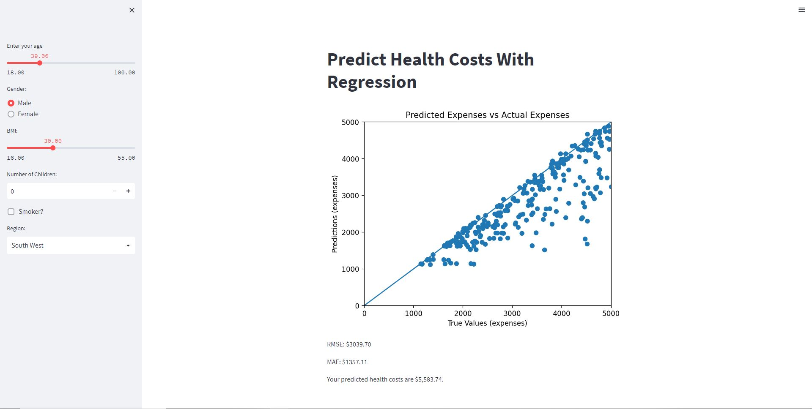

# Predict Health Costs With Regression

I made this model as part of the FreeCodeCamp challenges, but then updated it to use a scikit-learn model and made a Streamlit app.

## Docker

Build with:
> docker image build -t healthcostpredictor .

Run with:
> docker run -p 8501:8501 healthcostpredictor

## Get the data

Get the data by using:
> make getdata

## Running

Run with:
> streamlit run main.py
